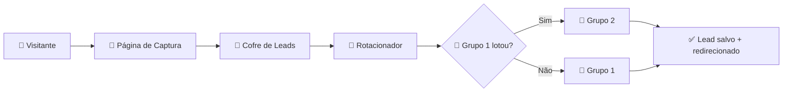

<p align="center">
  <picture>
    <source media="(prefers-color-scheme: dark)" srcset="https://cdn.jsdelivr.net/gh/yuriluisz/vortex/public/Vortex%20Padr%C3%A3o.svg">
    
  </picture>
</p>

<h1 align="center">
  Vórtex+ 🌪️
</h1>

<p align="center">
  <b>Automatize a captura de leads, distribua para grupos de WhatsApp</b><br>
  e <b>nunca mais perca uma venda</b> porque o grupo lotou.
</p>

<br>

<p align="center">
  <a href="#-funcionalidades">Funcionalidades</a> •
  <a href="#-stack">Stack</a> •
  <a href="#-pra-quem">Pra Quem</a> •
  <a href="#-planos">Planos</a> •
  <a href="#%EF%B8%8F-como-funciona">Como Funciona</a> •
  <a href="#-início-rápido">Início Rápido</a>
</p>

<p align="center">
  <a href="https://github.com/yuriluisz/vortex/actions">
    
  </a>
  <a href="https://nextjs.org/">
    
  </a>
  <a href="https://www.postgresql.org/">
    
  </a>
  <a href="https://redis.io/">
    
  </a>
  <a href="LICENSE">
    
  </a>
</p>

<br>

---

<br>

## 🔥 O PROBLEMA

> Você gira R\$ 1.000 em tráfego, sua página captura 200 leads…  
> Seu grupo de WhatsApp lota com 150.  
> **50 pessoas ficam de fora.**  
> **R\$ 250 vão direto pro lixo.**

**Não é culpa do seu tráfego. É culpa do seu funil.**

O WhatsApp limita grupos a 1.024 participantes. Em lançamentos e eventos ao vivo, um grupo enche em **minutos**. Se o seu sistema não distribuir os leads automaticamente entre múltiplos grupos, você **perde contatos, perde vendas, perde dinheiro.**

---

## 💰 O GANHO

<p align="center">
  <b>Com o Vórtex+, cada lead que chega encontra um grupo com vaga.</b><br>
  <b>Sempre.</b>
</p>

| Cenário | Captura | Perda | Dinheiro perdido |
|---------|---------|-------|-----------------|
| **Sem Vórtex+** 🚫 | 200 leads | ~50 (grupo lota) | ~R\$ 250/campanha |
| **Com Vórtex+** ✅ | 200 leads | 0 (rotação automática) | R\$ 0 |

1 campanha por mês → **R\$ 3.000/ano recuperados**.  
5 campanhas por mês → **R\$ 15.000/ano**.

**O Vórtex+ se paga na primeira campanha.**

---

## ⚡ COMO FUNCIONA



### 1. 📄 Página de Captura
Cole o HTML da sua página pronta (Webflow, Figma, código) ou crie uma do zero.  
O Vórtex+ injeta o formulário automaticamente onde você marcar com `{{FORM_SLOT}}`.  
**Tempo: 5 minutos.**

### 2. 💾 Cofre de Leads
Cada cadastro é salvo com segurança na sua base PostgreSQL.  
Nome, WhatsApp, respostas do formulário, IP, device, localização — tudo.  
**Sua base. Seu patrimônio.**

### 3. 🔄 Rotacionador Inteligente
O lead é redirecionado ao grupo do evento.  
Grupo encheu? O sistema detecta **em tempo real** e manda os próximos para o seguinte.  
**Zero perda. Zero gargalo. Zero manutenção.**

---

## 🚀 FUNCIONALIDADES

| Recurso | O que faz | Impacto no seu lucro |
|---------|-----------|---------------------|
| **Rotação automática** | Distribui leads entre N grupos sem você mexer um dedo | 🟢 **Perda zero de leads** |
| **Formulário dinâmico** | Schema configurável sem código (texto, select, checkbox…) | 🟢 **Zero dependência de dev** |
| **Domínio personalizado** | Sua marca no lugar da nossa (planos Pro+) | 🟢 **Autoridade + conversão** |
| **Cofre de leads** | Base de dados completa com metadata (IP, device, localização) | 🟢 **Base própria, remailings futuros** |
| **Dashboard em tempo real** | Contagem de leads, grupos ativos, campanhas | 🟢 **ROI visível em segundos** |
| **Pixel/Facebook Ads** | Dispare seu pixel nas páginas de captura | 🟢 **Remarketing pra quem não converteu** |
| **2FA + JWT** | OTP por email, sessão criptografada, cookie httpOnly | 🟢 **Segurança enterprise** |
| **Multi-tenant isolado** | Cada cliente com seu banco lógico separado | 🟢 **Dados nunca se misturam** |

---

## 🛡️ STACK TÉCNICA

Infraestrutura de **enterprise**, preço de **café**.

```
Frontend    Next.js 16 (App Router, Server Components, Server Actions)
Database    PostgreSQL 16 + Prisma ORM + adapter-pg
Cache       Redis 7 (rate limiting, sessão, rotacionador)
Auth        JWT (HS256, jose) + OTP por e-mail (Resend)
Auth 2FA    Código de 6 dígitos via Redis (5 minutos, 3 tentativas)
Rate Limit  Sliding window via Redis (login 5/min, OTP 3/5min, criação 1/h)
Isolamento  Multi-tenant com tenantId em todas as tabelas
Audit Log   Toda ação crítica registrada com IP, userId, tenantId
Deploy      Docker + PostgreSQL + Redis (qualquer VPS / Railway / Fly.io)
```

> **Segurança de ponta a ponta:**  
> ✅ Rate limiting contra brute force  
> ✅ Timing attack prevention na validação de credenciais  
> ✅ Session fixation prevention na troca de tenant  
> ✅ Proteção de rotas via middleware (proxy.ts)  
> ✅ Role-based access (SUPER_ADMIN / ADMIN / MEMBER)  
> ✅ Tenant inativo bloqueia login automaticamente  
> ✅ Todos os recursos verificam `requireTenantOwnership` antes de operar

---

## 👥 PRA QUEM É

| Perfil | O Vórtex+ resolve |
|--------|-------------------|
| **Infoprodutor** | Lançamentos com múltiplos grupos de WhatsApp — sem perder leads |
| **Agência de marketing** | Gerencia campanhas de vários clientes num painel só |
| **Coach / Mentor** | Eventos ao vivo com limite de vagas por grupo |
| **E-commerce** | Captura de leads com formulário + redirecionamento pra grupo de ofertas |
| **Qualquer um com tráfego** | Se você gasta dinheiro pra trazer gente, o Vórtex+ garante que ninguém escapa |

---

## 💰 PLANOS

| | **Free** | **Pro** | **Enterprise** |
|---|---|---|---|
| **Preço** | **R\$ 0** | **R\$ 97/mês** | **Sob medida** |
| Campanhas | 1 | 10 | Ilimitadas |
| Leads/mês | 100 | 10.000 | Ilimitados |
| Grupos | 3 | 50 | Ilimitados |
| Domínio próprio | ❌ | ✅ | ✅ |
| Marca Vórtex+ | ✅ | ❌ | ❌ |
| Suporte | — | Chat prioritário | Dedicado 24h |
| SLA | — | — | 99,9% uptime |
| | [Começar grátis](https://app.vortex.app) | [Assinar Pro](https://app.vortex.app) | [Falar com vendas](mailto:vendas@vortex.app) |

---

## 🏁 INÍCIO RÁPIDO

```bash
# 1. Clone
git clone https://github.com/yuriluisz/vortex.git
cd vortex

# 2. Instale
npm install

# 3. Configure as variáveis de ambiente
cp .env.example .env
# Edite .env com seus dados:
#   DATABASE_URL, REDIS_URL, JWT_SECRET, RESEND_API_KEY

# 4. Rode as migrations e seed
npx prisma migrate dev
npx prisma db seed

# 5. Inicie o dev server
npm run dev
```

### Variáveis de ambiente

| Variável | Obrigatória | Descrição |
|----------|-------------|-----------|
| `DATABASE_URL` | ✅ | PostgreSQL connection string |
| `REDIS_URL` | ✅ | Redis connection string |
| `JWT_SECRET` | ✅ | Chave para assinar JWTs (`openssl rand -base64 32`) |
| `RESEND_API_KEY` | ✅ | API key do Resend para envio de OTP |
| `RESEND_FROM_EMAIL` | ❌ | Email remetente (default: onboarding@resend.dev) |
| `ADMIN_EMAIL` | ❌ | Email do super admin (seed automático) |
| `ADMIN_PASSWORD_HASH` | ❌ | Hash bcrypt do super admin |

### Acessos padrão (seed)

```
Super Admin: admin@vortex.app / Admin123!
Demo User:   demo@vortex.app / Teste123!
Tenant:      default.vortex.app
```

---

## 📂 Estrutura do projeto

```
src/
├── app/
│   ├── [slug]/          # Páginas de captura (públicas)
│   ├── admin/           # Painel administrativo
│   │   ├── campaigns/   # CRUD de campanhas
│   │   ├── login/       # Autenticação OTP
│   │   ├── settings/    # Perfil, email, plano
│   │   └── super/       # Super admin (global)
│   └── docs/            # Documentação interna
├── components/
│   ├── admin/           # Componentes do painel
│   └── landing/         # Componentes da landing page
├── lib/
│   ├── auth.ts          # OTP, tenant lookup
│   ├── session.ts       # JWT, cookies
│   ├── audit.ts         # Audit logging
│   ├── plans.ts         # Plan limits enforcement
│   ├── rate-limit.ts    # Redis sliding window
│   ├── rotator.ts       # Rotacionador de grupos
│   └── tenant-guard.ts  # Isolamento multi-tenant
├── proxy.ts             # Middleware (proteção de rotas)
└── prisma/
    └── schema.prisma    # Modelo de dados
```

---

## 🧪 Testes

```bash
# Type-check
npx tsc --noEmit

# Lint
npm run lint
```

---

## 🤝 Contribuição

Pull requests são bem-vindos.  
Para mudanças grandes, abra uma issue primeiro.

---

## 📄 Licença

MIT &copy; 2026 — [Vórtex+](https://github.com/yuriluisz/vortex)

---

<p align="center">
  
  <br>
  <sub>Feito com 💜 pra nunca mais deixar um lead escapar.</sub>
</p>