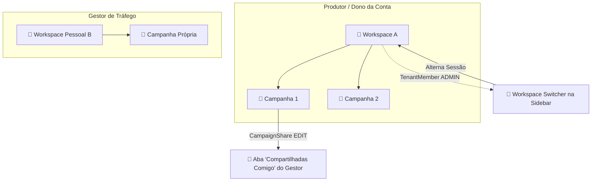

# Design Doc — Multi-Tenant Workspaces & Granular Campaign Sharing

> **Status:** Approved  
> **Date:** 2026-08-25  
> **Author:** Antigravity (Ponytail Senior Architecture)  
> **Feature:** Multi-Tenant team memberships & individual campaign sharing for traffic managers / guests

---

## 1. Overview & Business Value

Atualmente no Vórtex, um usuário está vinculado a um único Tenant (`User.tenantId`), e todas as campanhas pertencem exclusivamente àquele Tenant. 

Esta especificação introduz dois recursos essenciais de colaboração profissional:
1. **Compartilhamento Granular de Campanhas (`CampaignShare`):** Permite ao dono de uma campanha compartilhá-la diretamente com um gestor de tráfego / parceiro externo (via e-mail), concedendo acesso isolado com nível de permissão customizado (`Visualizador` ou `Editor/Gestor`), sem expor o restante da conta.
2. **Membros de Equipe & Multi-Tenant Switcher (`TenantMember`):** Permite convidar membros para a conta inteira (Tenant) e fornece um alternador de workspaces com 1 clique no topo da sidebar (estilo Vercel/Linear).

---

## 2. Architecture & Data Flow



---

## 3. Data Model & Prisma Schema

### 3.1 `TenantMember`
Relacionamento muitos-para-muitos entre `User` e `Tenant`:
```prisma
model TenantMember {
  id        String       @id @default(uuid())
  tenantId  String
  userId    String
  role      UserRoleExpr @default(MEMBER) // ADMIN | MEMBER
  createdAt DateTime     @default(now())

  tenant    Tenant       @relation(fields: [tenantId], references: [id], onDelete: Cascade)
  user      User         @relation(fields: [userId], references: [id], onDelete: Cascade)

  @@unique([tenantId, userId])
  @@index([userId])
  @@index([tenantId])
}
```

### 3.2 `CampaignShare`
Compartilhamento granular de campanha com permissão selecionável:
```prisma
enum CampaignPermission {
  VIEW // Visualizador: Dashboard, leads, métricas e grupos (somente leitura)
  EDIT // Gestor de Tráfego / Editor: Dashboard, leads, grupos + edição de pixels/HTML/grupos
}

model CampaignShare {
  id         String             @id @default(uuid())
  campaignId String
  userId     String?            // Null se ainda pendente de cadastro
  email      String             // E-mail do gestor/convidado
  permission CampaignPermission @default(VIEW)
  token      String?            @unique // Token seguro de onboarding
  accepted   Boolean            @default(false)
  createdAt  DateTime           @default(now())

  campaign   Campaign           @relation(fields: [campaignId], references: [id], onDelete: Cascade)
  user       User?              @relation(fields: [userId], references: [id], onDelete: Cascade)

  @@unique([campaignId, email])
  @@index([userId])
  @@index([email])
}
```

---

## 4. Frontend & User Experience

### 4.1 Workspace Switcher (Sidebar Top)
- Dropdown no topo da sidebar esquerda mostrando o Workspace atual com badge do plano.
- Ao clicar, exibe:
  - **Seu Workspace Pessoal**
  - **Workspaces da Equipe** (onde você é `ADMIN` ou `MEMBER`)
  - Ação rápida para trocar de contexto instantaneamente.

### 4.2 Listagem de Campanhas (`/admin/campaigns`)
- Duas abas superiores:
  - **Minhas Campanhas:** Campanhas criadas no workspace ativo.
  - **Compartilhadas Comigo:** Campanhas recebidas via `CampaignShare`, com badge de quem compartilhou (nome/e-mail do dono) e badge de permissão (`Visualizador` ou `Gestor`).
- Campanhas compartilhadas bloqueiam a ação irreversível de "Excluir Campanha".

### 4.3 Modal de Compartilhamento de Campanha (`CampaignShareModal`)
- Acessível pelo card da campanha em `/admin/campaigns` e pelo botão "Compartilhar" no editor da campanha.
- Input de e-mail + seletor de permissão (`Visualizador` ou `Gestor de Tráfego / Editor`).
- Lista de convidados ativos com opção de revogar acesso com 1 clique.

### 4.4 Gerenciamento de Equipe (`/admin/settings` - Aba Equipe)
- Listagem dos membros da equipe do Tenant.
- Botão "Convidar Membro" (e-mail + role: `ADMIN` ou `MEMBER`).
- Botão de remover membro (bloqueando a auto-remoção do Dono original).

---

## 5. Security & Access Control (RBAC)

### 5.1 Guard de Permissão de Campanha (`src/lib/permissions.ts`)
```ts
export async function requireCampaignAccess(
  campaignId: string,
  userId: string,
  requiredPermission: "VIEW" | "EDIT" = "VIEW"
): Promise<{ allowed: boolean; role: "OWNER" | "MEMBER" | "SHARED_EDITOR" | "SHARED_VIEWER"; campaign: Campaign }>
```
- **Hierarquia:**
  1. Dono do Tenant (`Campaign.tenantId === user.tenantId`): Permissão total (`OWNER`).
  2. Membro do Tenant (`TenantMember` ativo): Permissão total (`MEMBER`).
  3. Convidado (`CampaignShare` ativo): Permissão conforme `permission` (`SHARED_EDITOR` ou `SHARED_VIEWER`).
  4. Qualquer outro usuário: `403 Acesso Negado`.

### 5.2 Fluxo de Convites & Onboarding
- **Usuário Existente:** Ao convidar um e-mail já cadastrado, o vínculo é associado imediatamente e um e-mail informativo é disparado via Resend.
- **Novo Usuário:** Gera token aleatório de 32 bytes (`crypto.randomUUID()`) e envia e-mail com link `/accept-invite?token=...`. O convidado define sua senha e é redirecionado direto para o painel com o compartilhamento já ativo.

---

## 6. Verification & Quality Gates

- Testes unitários com Vitest:
  - Validação de permissões e hierarquia de acesso (`requireCampaignAccess`).
  - Isolamento de dados entre tenants e campanhas compartilhadas.
- Quality Gates do Vortex:
  - `npx prisma generate` + `npx prisma db push`
  - `npx tsc --noEmit`
  - `npm run lint`
  - `npm test`
  - `npm run build`
